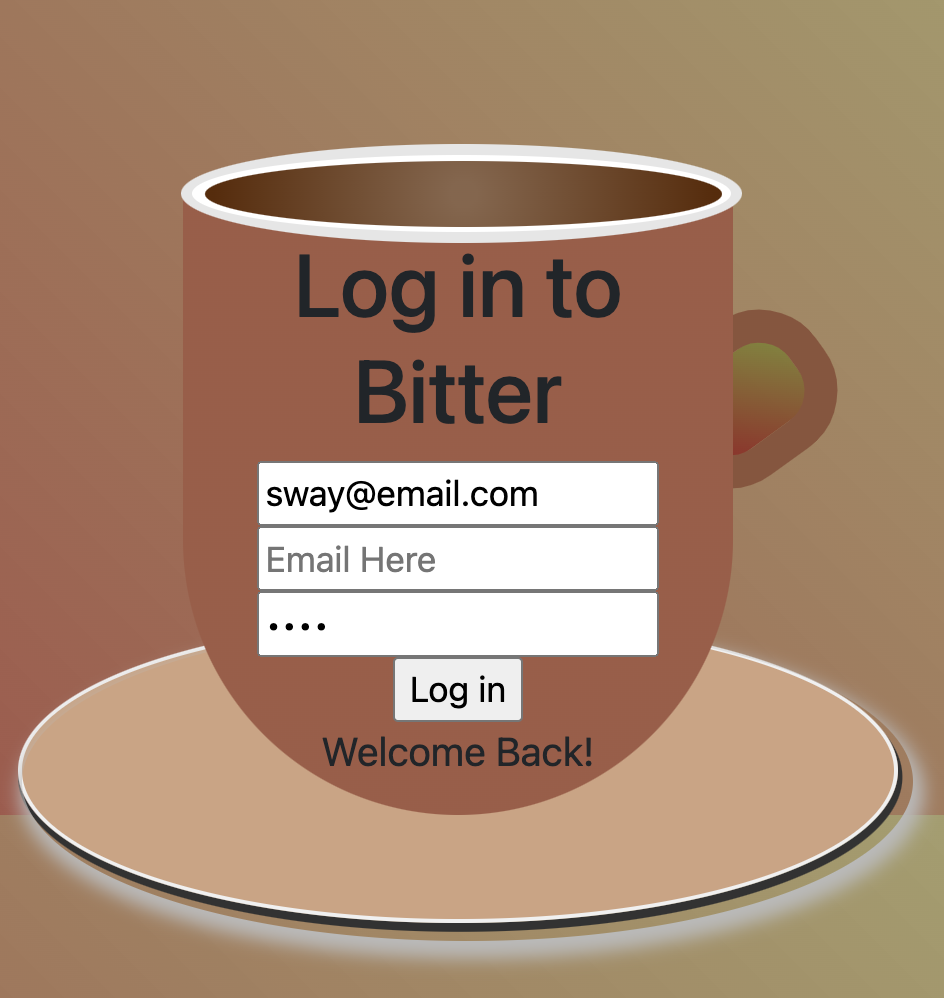
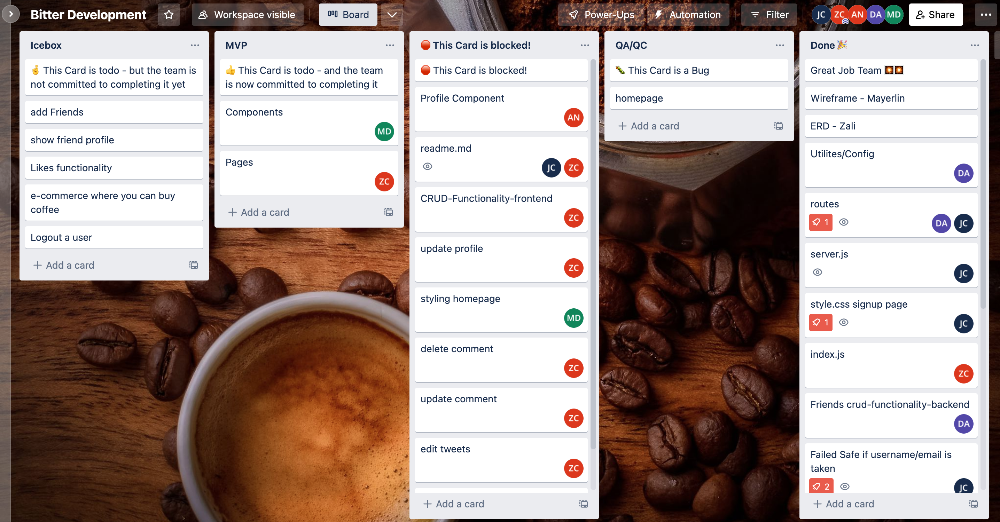

<div style='font-size:40px;text-align:center;align-items:center;'>

 Bitter your not so friendly twitter clone
</div>

<div style="display:flex;justify-content:center;">


</div>

## Getting Started with the code (Bitter)
- Once you navigate to the App it will bring you to the Signup Page.
- You will be required to enter your credentials(username, email and password has to be atleast 4 characters)

## Contributing Developers
- Zali Cross
- Devon Aimes
- Ashley Du
- Mayerlin Duluc
- Josue Cuellar

```js
import { useEffect, useState } from 'react'
import Sidebar from '../../components/sidebar/Sidebar'
import EditProfile from '../../components/EditProfile/EditProfile'
import ProfileHeader from "../../components/ProfileHeader/ProfileHeader";
import Follows from '../../components/Follows/follows';
import EditButton from '../../components/EditButton/EditButton';
import Feed from "../../components/Feed/Feed";
import Widgets from "../../components/Widgets/Widgets";
import TweetForm from '../../components/tweetForm/TweetForm';
import UserFeed from '../../components/UserFeed/UserFeed';


export default function Profile() {


    const [isLiked, setIsLiked] = useState(false);
    const [toggleComment, setToggleComment] = useState(false)
    const [user, setUser] = useState(null);
    const [userProfile, setUserProfile] = useState(null)
    const [followers, setFollowers] = useState([])
    const [userTweets, setUserTweets] = useState([])
    const [foundProfile, setFoundProfile] = useState(null)
    const [updatedProfile, setUpdatedProfile] = useState({
        dob: '',
        name: '',
        location: '',
        interests: '',
        photo: '',
    })
    const [tweet, setTweet] = useState({
        userId: '',
        username: '',
        text: "",
    });
    const [token, setToken] = useState("")
    const [tweets, setTweets] = useState([]);
    const [comments, setComments] = useState([])

    const [comment, setComment] = useState({
        userId: '',
        text: ''
    })

    const handleChange = (e) => {
        e.preventDefault()
        setUpdatedProfile({ ...updatedProfile, [e.target.name]: e.target.value })
    }

    const getAUserTweets = async () => {
        try {
            const response = await fetch('/api/profile/tweets', {
                method: 'GET',
                headers: {
                    'Content-Type': 'application/json',
                    Authorization: `Bearer ${JSON.parse(localStorage.getItem('token'))}`
                }
            })
            const data = await response.json()
            console.log('users tweets', data)
            setUserTweets(data)
        } catch (err) {
            console.log(err)
        }
    }

    const getProfile = async () => {
        try {
            const response = await fetch('/api/profile', {
                method: 'GET',
                headers: {
                    'Content-Type': 'application/json',
                    Authorization: `Bearer ${JSON.parse(localStorage.getItem('token'))}`
                }
            })
            const data = await response.json()
            console.log('profile data', data)
            setUserProfile(data)
        } catch (error) {
            console.error(error)
        }
    }

    const getFollowers = async () => {
        try {
            const response = await fetch('/api/profile/followers', {
                method: 'GET',
                headers: {
                    'Content-Type': 'application/json',
                    Authorization: `Bearer ${JSON.parse(localStorage.getItem('token'))}`
                }
            })
            const data = await response.json()
            setFollowers()
        } catch (err) {
            console.log(err)
        }
    }


    const updateProfile = async (profileId, updatedProfile) => {
        try {
            const response = await fetch(`/api/profile/${profileId}`, {
                method: 'PUT',
                headers: {
                    'Content-Type': 'application/json',
                    Authorization: `Bearer ${JSON.parse(localStorage.getItem('token'))}`
                },
                body: JSON.stringify(updatedProfile)
            })
            const data = await response.json()
            console.log('updatedProfile', data)
            setUserProfile(data)
        } catch (err) {
            console.log(err)
        }
    }

    const createTweet = async () => {
        try {
            const response = await fetch("/api/tweets", {
                method: "POST",
                headers: {
                    "Content-Type": "application/json",
                    Authorization: `Bearer ${token}`,
                },
                body: JSON.stringify({ ...tweet }),
            });
            console.log(response);
            const data = await response.json();
            console.log(data);
            setTweets([data, ...tweets]);
        } catch (error) {
            console.error(error);
        } finally {
            setTweet({
                text: " ",
            });
        }
    };

    const getUser = async () => {
        try {
            const response = await fetch('/api/users', {
                method: 'GET',
                headers: {
                    'Content-Type': 'application/json',
                    Authorization: `Bearer ${JSON.parse(localStorage.getItem('token'))}`
                }
            })
            const data = await response.json()
            console.log(data)
            setUser(data)
        } catch (error) {
            console.error(error)
        }
    }


    const deleteTweet = async (id) => {
        try {
            const response = await fetch(`/api/tweets/${id}`, {
                method: 'DELETE',
                headers: {
                    'Content-Type': 'application/json',
                    Authorization: `Bearer ${token}`
                }
            })
            const data = await response.json()
            const tweetsCopy = [...tweets]// need to make a copy before you can manutiplate the array
            const index = tweetsCopy.findIndex(tweet => id === tweet._id) //find the id to delete from the list
            tweetsCopy.splice(index, 1)
            setTweets(tweetsCopy)
        } catch (error) {
            console.error(error)
        }
    }

    const editTweet = async (tweetId, updatedTweet) => {
        try {
            const response = await fetch(`/api/tweets/${tweetId}`, {
                method: 'PUT',
                headers: {
                    'Content-Type': 'application/json',
                    Authorization: `Bearer ${JSON.parse(localStorage.getItem('token'))}`
                },
                body: JSON.stringify(updatedTweet)
            })
            const data = await response.json()
            const tweetsCopy = [...tweets]
            const index = tweetsCopy.findIndex(tweet => tweetId === tweet._id)
            tweetsCopy[index] = { ...tweetsCopy[index], ...updatedTweet }
            setTweet(data)
        } catch (err) {
            console.error(err)
        }
    }

    const createComment = async (tweetId, userId, username) => {
        try {
            const response = await fetch(`/api/comments/${tweetId}`, {
                method: "POST",
                headers: {
                    "Content-Type": "application/json",
                    Authorization: `Bearer ${token}`,
                },
                body: JSON.stringify({ ...comment }),
            });
            const data = await response.json();
            setComments([data, ...comments]);
            setToggleComment(!toggleComment)
        } catch (error) {
            console.error(error);
        } finally {
            setComment({
                userId: userId,
                username: username,
                text: " ",
            });
        }
    };

    const getAllComments = async (tweetId, commentId) => {
        try {
            const response = await fetch(`/api/comments/${tweetId}/${commentId}`, {
                method: 'GET',
                headers: {
                    'Content-Type': 'application/json',
                    Authorization: `Bearer ${JSON.parse(localStorage.getItem('token'))}`
                }
            })
            const data = await response.json()
            setTweets(data)
        } catch (error) {
            console.error(error)
        }
    }

    const deleteComment = async (tweetId, commentId) => {
        try {
            const response = await fetch(`/api/comments/${tweetId}/${commentId}`, {
                method: 'DELETE',
                headers: {
                    'Content-Type': 'application/json',
                    Authorization: `Bearer ${JSON.parse(localStorage.getItem('token'))}`
                }
            })
            const data = await response.json()
            const commentsCopy = [...comments]// need to make a copy before you can manutiplate the array
            const index = commentsCopy.findIndex(comment => commentId === comment._id) //find the id to delete from the list
            commentsCopy.splice(index, 1)
            setComments(commentsCopy)
            setToggleComment(!toggleComment)
        } catch (err) {
            console.error(err)
        }
    }

    const editComment = async (tweetId, id, updatedComment) => {
        try {
            const response = await fetch(`/api/comments/${tweetId}/${id}`, {
                method: 'PUT',
                headers: {
                    'Content-Type': 'application/json',
                    Authorization: `Bearer ${JSON.parse(localStorage.getItem('token'))}`
                },
                body: JSON.stringify({
                    ...comment,
                    userId: user._id,
                    text: updatedComment
                })
            })
            const data = await response.json()
            setComment(data)
        } catch (err) {
            console.error(err)
        }
    }

    useEffect(() => {
        getProfile()
        getUser()
        getFollowers()
        getAUserTweets()
    }, [])

    useEffect(() => {
        const tokenData = localStorage.getItem('token')
        if (tokenData && tokenData !== 'null' && tokenData !== 'undefined') {
            setToken(JSON.parse(tokenData))
        }
    }, [toggleComment, isLiked])


    console.log('user', user)

    return (
        <>
            <ProfileHeader
                user={user}
                userProfile={userProfile}
                updateProfile={updateProfile}
                handleChange={handleChange}
                updatedProfile={updatedProfile} />
            <Follows />
            <EditButton
                userProfile={userProfile}
                updateProfile={updateProfile}
                handleChange={handleChange}
                updatedProfile={updatedProfile}
            />
            <Sidebar
                user={user}
                setUser={setUser} />
            <UserFeed
                userTweets={userTweets}
                user={user}
                createTweet={createTweet}
                editTweet={editTweet}
                deleteTweet={deleteTweet}
                comment={comment}
                setComment={setComment}
                createComment={createComment}
                deleteComment={deleteComment}
                editComment={editComment}
                isLiked={isLiked}
                setIsLiked={setIsLiked}
            />
            <Widgets />
        </>
    )
}

```

## Technologies
- HTML
- React
- CSS
- Mongodb
- Material UI
- React flip move library -animation when posting tweets

<div style='font-size:20px'>
Trello Board
</div>
 https://trello.com/b/1tSPTNy5/bitter-development
 
-HTML
-React
-CSS
-Mongodb
-Material UI
-React flip move library -animation when posting tweets


## localhost:3001/api/users
| Action | URL | HTTP Verb | Mongoose Method|
|---|---|---|---|
| create  | / | POST | User.create()&Profile.create() |
| getUser | / | GET | User.findById() |
| login | /login | POST | User.findOne() |

------

## localhost:3001/api/tweets
| Action | URL | HTTP Verb | Mongoose Method|
|---|---|---|---|
| getAllTweets  | / | GET | Tweet.find() |
| destroyTweet | /:id | DELETE | Tweet.findByIdAndDelete() |
| updateTweet | /:id | PUT | Tweet.findByIdAndUpdate() |
| createTweet | / | POST | Tweet.create() |
| getOneTweet | /:id | GET | Tweet.findById() |
| updateLikes | /:id/likes | GET | currentTweet.updateOne() |

-----

## localhost:3001/api/profile
| Action | URL | HTTP Verb | Mongoose Method|
|---|---|---|---|
| updateProfile  | /:id | PUT | Tweet.find() |
| followProfile | /:followerId/follow | PUT | profile.updateOne() |
| unfollowProfile | /:followerId/unfollow | PUT | profile.updateOne() |
| getRandomProfile | /random/:randomId | GET | Profile.findById() |
| getUserTweets | /tweets | GET | Profile.findById(), profile.tweets |
| getFollowers | /followers | GET | profile.findById() |
| getProfile | / | GET | User.findOne(), user.profile |

-----

## localhost:3001/api/comments
| Action | URL | HTTP Verb | Mongoose Method|
|---|---|---|---|
| getAllComments  | /:tweetId | GET | Tweet.findById() |
| destroyComment| /:tweetId/:id | DELETE | Comment.findByIdAndDelete() |
| updateComment | /:tweetId/:id | PUT | Comment.findByIdAndUpdate() |
| getOneComment | /:tweetId/:id  | GET | Comment.findById() |
| createComment | /:tweetId | POST | Comment.create() |
| updateLikes | /:tweetId/:id/likes | GET | currentComment.updateOne() |
